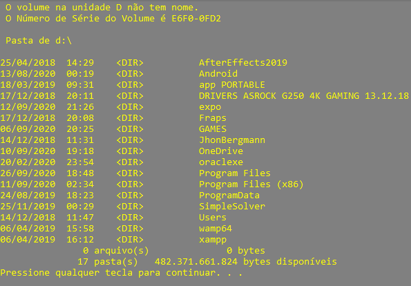
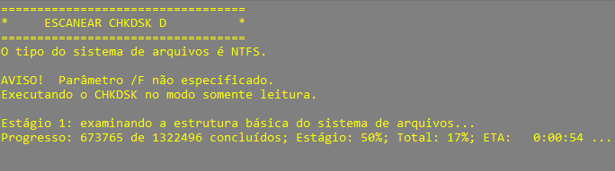

<h1 align="center">
  Script Bat | ToolsWindows
</h1>

 

  
  
  

## 📝 Licença

Esse projeto está sob a licença MIT. Veja o arquivo [LICENSE](LICENSE) para mais detalhes.

---

 Feito com 💜 by Jhonatan Bergmann

